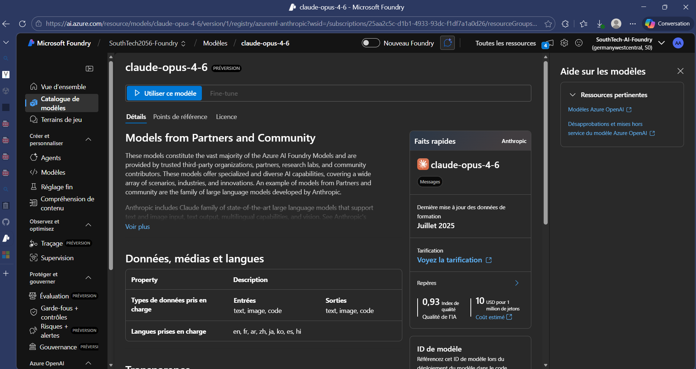
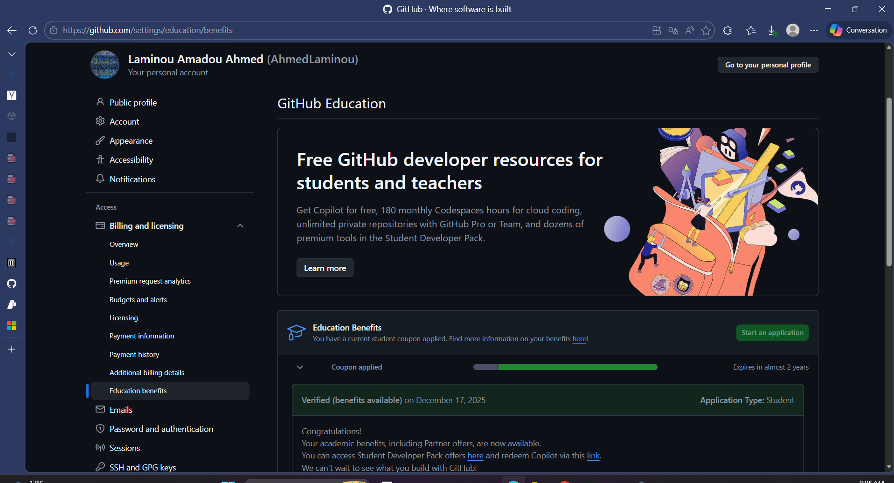
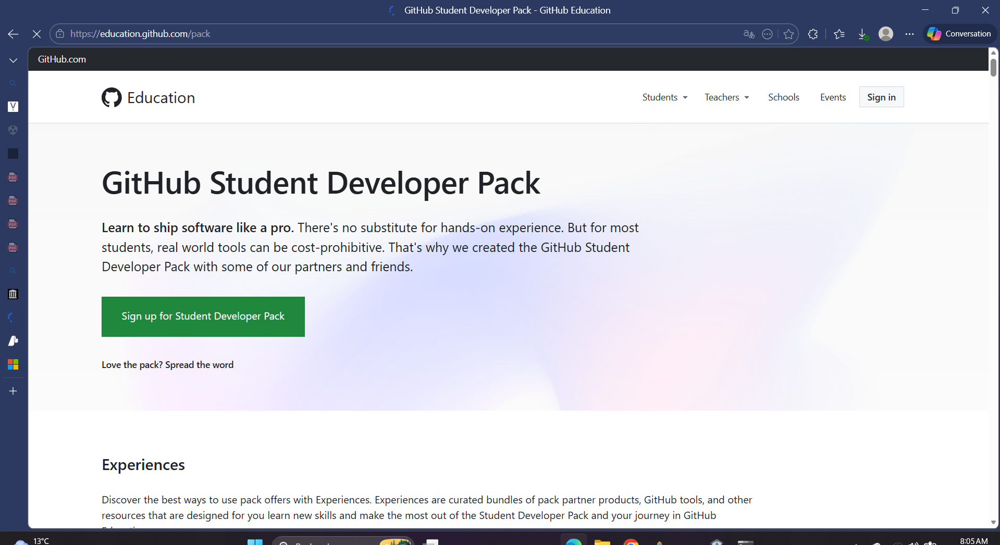
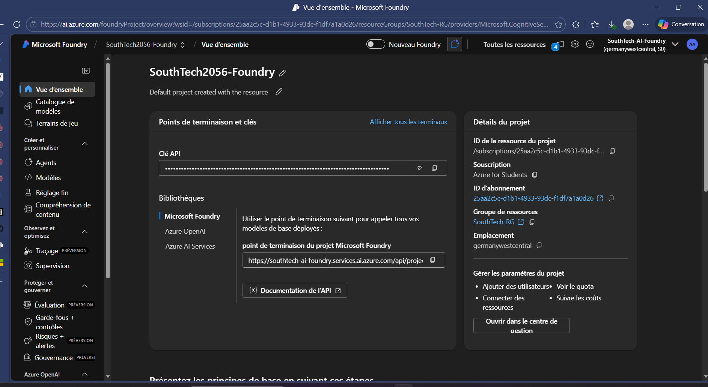

# 🎓 Masterclass : IA de Pointe Gratuite (Claude  & Azure) pour Étudiants

> **Le guide ultime pour transformer vos 100$ Azure Student en un hub d'intelligence artificielle surpuissant.**



## 📖 Introduction

En tant qu'étudiant, l'accès aux modèles de langage (LLM) les plus performants comme **Claude 3.5 Sonnet** ou **Opus** est souvent limité par le prix. Ce guide vous montre comment utiliser le **GitHub Student Pack** pour débloquer **100$ sur Microsoft Azure** et configurer **Microsoft AI Foundry** pour piloter vos projets de code via le CLI **Claude Code**.

---

## 🛠️ Étape 1 : Activer la "Carte Gold" Étudiante

Tout commence avec le **GitHub Student Developer Pack**.

1.  Rendez-vous sur [education.github.com/pack](https://education.github.com/pack).
2.  Inscrivez-vous avec votre e-mail académique (en `.edu` ou `.fr`).
3.  Une fois accepté, cherchez l'avantage **Microsoft Azure**.
4.  **Activation :** Suivez le lien vers Azure. Vous recevrez **100$ de crédits** sans avoir à entrer de carte bancaire.
    - _Note : Si Azure vous demande votre numéro de carte, vous n'êtes pas sur la bonne page "Education". Revenez en arrière._

---

## 🏗️ Étape 2 : Configurer Microsoft AI Foundry

Azure AI Foundry est l'interface pro pour gérer vos modèles d'IA.

1.  Connectez-vous sur [ai.azure.com](https://ai.azure.com).
2.  **Créer un Projet :** Donnez-lui un nom (ex: `MyAIProject`).
3.  **Choix de la Région :** Pour avoir accès aux modèles Claude, choisissez `Germany West Central` ou `Switzerland North`.
4.  **Catalogue de Modèles :** Allez dans le menu "Modèles" et cherchez **Claude 3.5 Sonnet**.
5.  **Déploiement :** Cliquez sur "Utiliser ce modèle" (Provisionner).
    - **Nom du déploiement :** Utilisez `claude-sonnet-4-6`. C'est l'identifiant que vos scripts liront.
    - Faites de même pour **Claude 3 Opus** si besoin.



---

## 🔑 Étape 3 : Récupérer les clés de puissance

Une fois le modèle déployé, vous avez besoin de deux informations :

1.  Allez dans l'onglet **"Ressources"** ou **"Endpoints"** de votre projet.
2.  Copiez votre **Clé API** (Key 1).
3.  Copiez le **Point de terminaison** (Endpoint URL). C'est l'adresse à laquelle votre code va "frapper" pour parler à l'IA.



---

## ⚡ Étape 4 : Automatisation avec Claude Code

Le CLI **Claude Code** d'Anthropic est un agent qui peut modifier vos fichiers, lancer des tests et construire des projets. Pour qu'il utilise votre crédit Azure, nous allons utiliser un "Switcher".

### A. Configuration du fichier `.env.ai`

Créez un fichier `.env.ai` à la racine de votre projet (ne le partagez jamais sur GitHub !) :

```ini
AZURE_OPUS_KEY=votre_cle_azure_ici
AZURE_OPUS_URL=votre_url_endpoint_ici

AZURE_SONNET_KEY=votre_cle_azure_ici
AZURE_SONNET_URL=votre_url_endpoint_ici
```

### B. Le Script de Connexion (`switch-ai.ps1`)

Ce script PowerShell injecte vos clés dans l'environnement pour que Claude Code les reconnaisse instantanément.

```powershell
param([string]$Profile)

# Charge les secrets depuis le fichier .env
if (Test-Path ".env.ai") {
    $EnvFile = Get-Content ".env.ai"
    foreach ($line in $EnvFile) {
        if ($line -match "^(?<key>[^=]+)=(?<value>.+)$") {
            [System.Environment]::SetEnvironmentVariable($Matches.key, $Matches.value, "Process")
        }
    }
}

switch ($Profile) {
    "sonnet" {
        $env:CLAUDE_CODE_USE_FOUNDRY = "1"
        $env:ANTHROPIC_FOUNDRY_API_KEY = $env:AZURE_SONNET_KEY
        $env:ANTHROPIC_FOUNDRY_BASE_URL = $env:AZURE_SONNET_URL
        $env:ANTHROPIC_DEFAULT_SONNET_MODEL = "claude-sonnet-4-6"
        Write-Host ">>> MODE SONNET ACTIF (Azure)" -ForegroundColor Green
    }
    "opus" {
        $env:CLAUDE_CODE_USE_FOUNDRY = "1"
        $env:ANTHROPIC_FOUNDRY_API_KEY = $env:AZURE_OPUS_KEY
        $env:ANTHROPIC_FOUNDRY_BASE_URL = $env:AZURE_OPUS_URL
        $env:ANTHROPIC_DEFAULT_OPUS_MODEL = "claude-opus-4-6"
        Write-Host ">>> MODE OPUS ACTIF (Azure)" -ForegroundColor Cyan
    }
}
```

---

## 🚀 Étape 5 : Lancement

1.  Installez Claude Code : `npm install -g @anthropic-ai/claude-code`
2.  Activez le profil : `. .\switch-ai sonnet`
3.  Lancez le génie : `claude`
4.  **Sélection :** Choisissez l'option **"3rd-party platform"** lors de la première connexion.



---

## 💡 Astuces & Limites

- **Crédits :** Surveillez vos 100$ sur le portail Azure. Claude Opus consomme plus de crédits que Sonnet.
- **Vitesse :** Si vous déployez en `Germany West Central`, la latence est excellente depuis l'Europe.
- **Sécurité :** Ajoutez toujours `.env.ai` à votre fichier `.gitignore`.

---

